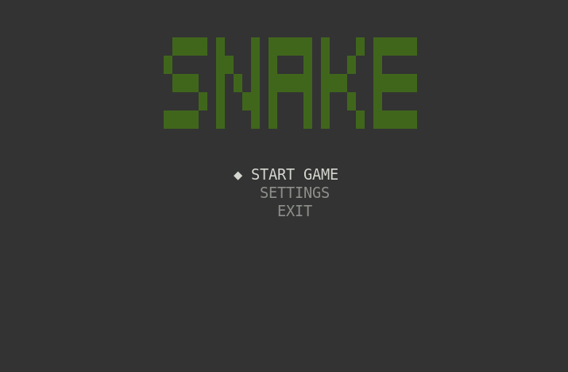
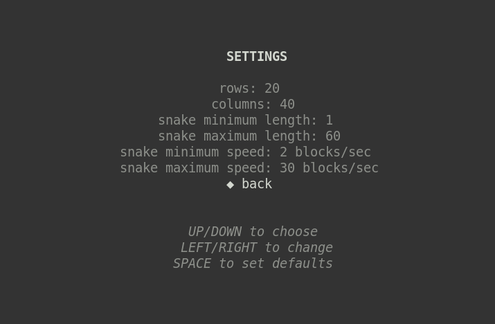
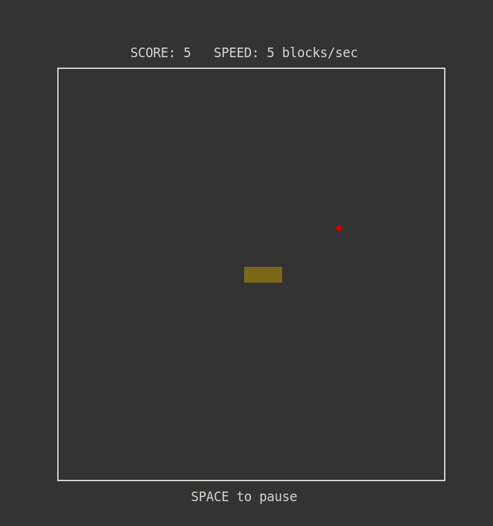
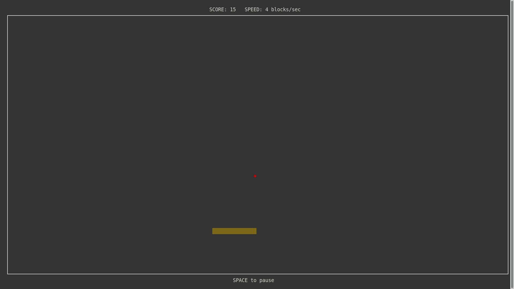
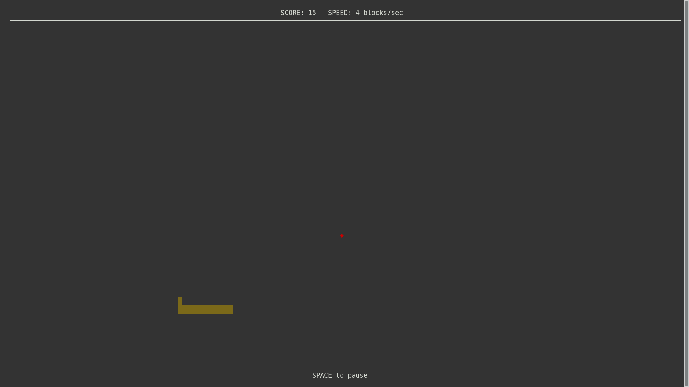
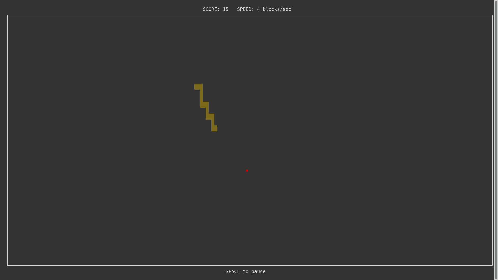
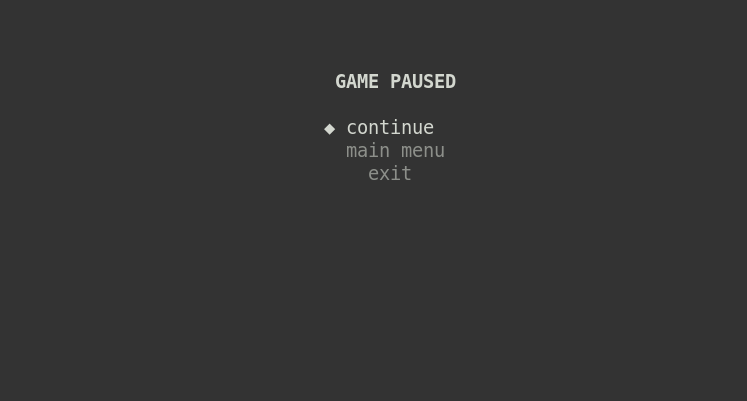
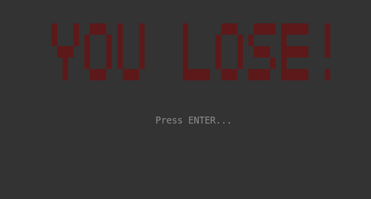

# Snake Game in C++ and ncurses

This is just another Snake game, written in C++ and ncurses on Linux. It has a Main Menu, Pause Menu and Settings Menu. Field size, minimum/maximum speed and minimum/maximum Snake length can be manipulated in Settings Menu. The Snake speed gradually increases as it grows in size. You win by reaching the maximum size previously set in Settings.

mkdir release
make all
release/snake.out

